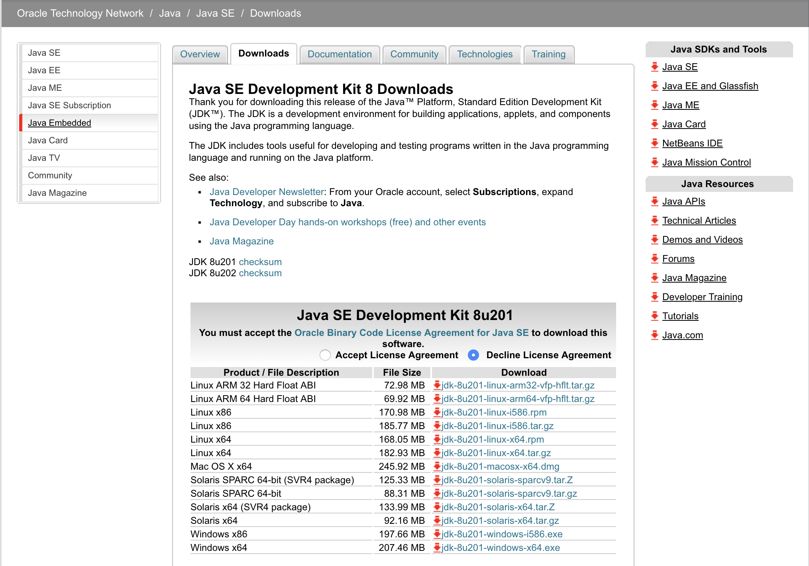
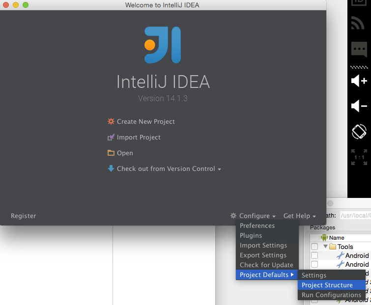
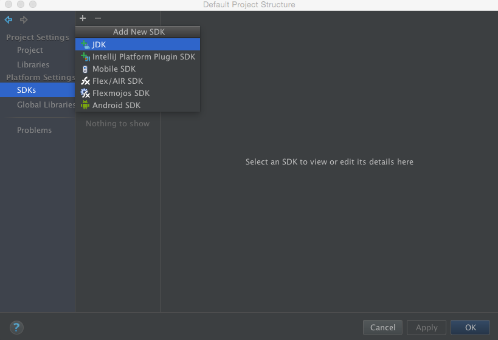

Welcome to the first Java tutorial. Before we type any Java code, 
we will need set up an Integrated Development Environment (IDE)
to help us with writing and running Java programs easily on our computer.


## Install The Java Development Kit (JDK)
The Java Development Kit  is a software development environment used for developing Java applications and applets. 
It includes the Java Runtime Environment (JRE), an interpreter/loader (java), a compiler (javac), 
archivers (jars), a documentation generator (javadoc) and other tools needed in Java development.

For typical Java programs, we would need the Standard Edition JDK. 
1. Navigate to Oracle's website following this [link](https://www.oracle.com/technetwork/java/javase/downloads/jdk8-downloads-2133151.html)
2. Accept the License Agreement 
    * 
3. Download the appropriate JDK version. (You might need to create an Oracle account to download the JDK)  
4. Set `JAVA_HOME` 
    ##### MAC
    * Open `Terminal.app`
    * Run these command (jdk-install-location should be somewhere like this - /Library/Java/JavaVirtualMachines/jdk1.8.0_41.jdk)
    ```shell 
    export JAVA_HOME=jdk-install-location 
    export PATH=$JAVA_HOME/bin:$PATH
    ```
    ##### Windows
    * Right click `My Computer` and select `Properties`.
    * On the `Advanced` tab, select `Environment Variables`.
    * Edit `JAVA_HOME` by setting it to the jdk-install-location, for example, C:\Program Files\Java\jdk1.8.0_02.


## Configure IntelliJ IDEA
* Install [IntelliJ IDEA](https://www.jetbrains.com/idea/download/)
* Open IntelliJ IDEA
* The IntelliJ Welcome screen will be displayed
  * Add required SDKs
  * Click on `Configure > Project Defaults > Project Structure`
    * 
  * Select `SDKs`
  * Add Java Development Kit
    * Click `+ > JDK`
     *  
    * Note: Press `Cmd + Shift + .` to show hidden files in the file chooser dialog.
    * Navigate to the JDK location.  
      * MAC example location: `/Library/Java/JavaVirtualMachines/jdk1.8.0_41.jdk`
      * Windows example location `C:\Program Files\Java\jdk1.6.0_02`
    * Select the JDK folder
  * Click **OK**

## Create A Basic Java Project
